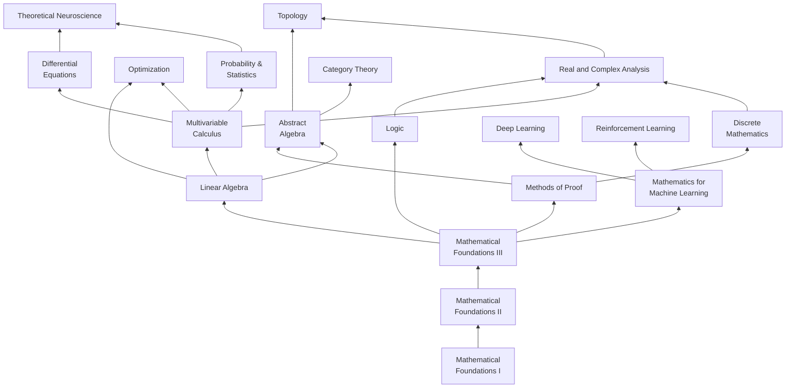

I'm starting this blog as a way to document progress on a long-standing goal of mine — teaching myself mathematics (with a bit of physics/CS too). I've been wanting to do this ever since I joined a theoretical neuroscience lab in my bachelor's, but for a long time I was a) afraid of failure and b) dealing with a large range of health issues.

## Why am I doing this?

In early 2021, in the midst of COVID, I had the realization I would end up working either on psychopharmacology or theoretical neuroscience and cognitive science. So I did a master's in cognitive neuroscience and psychopharmacology and hated it, but did some interesting research along the way that, slowly but surely, took me toward what I consider "deeper" questions in neuroscience and AI. Now, I feel deeply enamored by questions around the relationship of substrate and cognition, how networks learn, learning rules in general, and perhaps most importantly, how biological neural networks give rise to consciousness, or more precisely, subjective experience. It is not just a scientific question, but a philosophical one, that might be solved through the slow regression of the 'easy questions' (see: [The Real Problem](https://aeon.co/essays/the-hard-problem-of-consciousness-is-a-distraction-from-the-real-one)) against the *harder* problem. Right now, the link between a network architecture and the model it might build, or the [inductive biases](https://en.wikipedia.org/wiki/Inductive_bias#:~:text=Inductive%20bias%20is%20anything%20which,good%20explanation%20of%20the%20data.) it incorporates, feels a lot like the [hard problem](https://consc.net/papers/facing.pdf). Maybe the brilliant engineers and scientists working on these models feel that way, too, but I can't even grok a basic dynamical system right now, so I have no idea!

So, it's time to learn math. I've decided to build this website and document my journey as a way of motivating myself and building a portfolio along the way. There are many brilliant mathematicians and engineers out there, and if I hope to compete, I will really need to show my work. In a few months, I'll attend the [Gatsby Bridging Programme](https://www.ucl.ac.uk/gatsby/study-and-work/gatsby-bridging-programme), but until then I'm going to speed-run as much math as I can stomach.

## A syllabus of sorts
I've cobbled together a learning plan based on MIT's excellent [OpenCourseWare](https://ocw.mit.edu/), some textbooks I've been recommended, and the Open Source Society University's [math course](https://github.com/ossu/math). I've been following the team at [Math Academy](https://www.mathacademy.com/) for a while now and have decided to make MA my primary form of learning, using textbooks and courses as supplementary (especially while traveling or when I'm without access to a laptop + iPad to study from). Their team has clearly thought through their [method](https://www.mathacademy.com/pedagogy) and it works well for me. I'm not sure why there isn't more competition for this kind of approach. Reversing [the decline of genius](https://www.theintrinsicperspective.com/p/why-we-stopped-making-einsteins) is one of the most exciting use-cases for AI (and specifically chatbots). Without sounding like a shill for them, their approach is based on feedback, using AI to solve the [sigma-2 problem](https://www.jstor.org/stable/1175554) — that is, students tutored one-to-one perform, on average, two standard deviations (98% in a normal distribution!) better than students learning via conventional methods. 

Of course, one has to believe that the feedback that chatbots can provide is *effective* in principle or in practice (see a [counterargument](https://joshbrake.substack.com/p/ai-tutors-cant-solve-blooms-two-sigma-problem)). I'm not convinced by the idea that *most* teachers outperform chatbots in identifying the source of human error and the emotion involved right now, let alone in a few years. From my own educational experience, it's clearly not the case — the learning I do with LLMs is significantly more effective. 

Here's a rough outline for my approach:

I don't want to suggest that advanced linear algebra, probability, etc. is not necessary for deep learning, but if I add in *all* the links then this graph will be a total mess. I plan to finish through Mathematical Foundations II/III, and then move on to the other available courses that MA has posted. At linear algebra and beyond, I'll work with some textbooks and lecture series, too:

| Course                           | Book                                                                                                                                                                                                                                                                                                                                    | Lecture series                                                                                                                                                                                                                                                                                                                                                                                                                           |
| -------------------------------- | --------------------------------------------------------------------------------------------------------------------------------------------------------------------------------------------------------------------------------------------------------------------------------------------------------------------------------------- | ---------------------------------------------------------------------------------------------------------------------------------------------------------------------------------------------------------------------------------------------------------------------------------------------------------------------------------------------------------------------------------------------------------------------------------------- |
| Linear algebra                   | [Linear Algebra and its Applications](https://books.google.fr/books/about/Linear_Algebra_and_Its_Applications.html?id=KrU7mgEACAAJ&source=kp_book_description&redir_esc=y) [Immersive Linear Algebra](https://immersivemath.com/ila/index.html) [The Matrix Cookbook](https://www.math.uwaterloo.ca/~hwolkowi/matrixcookbook.pdf) | [Gilbert Strang's Spring 2010](https://ocw.mit.edu/courses/18-06-linear-algebra-spring-2010/) [Essence of Linear Algebra](https://www.youtube.com/watch?v=kjBOesZCoqc&list=PL0-GT3co4r2y2YErbmuJw2L5tW4Ew2O5B)                                                                                                                                                                                                                        |
| Mathematics for Machine Learning | [Mathematics for Machine Learning](https://mml-book.github.io/) [100 Page ML Book](https://themlbook.com/) [The Little Book of Deep Learning](https://fleuret.org/francois/lbdl.html)                                                                                                                                             | [Introduction to ML](https://openlearninglibrary.mit.edu/courses/course-v1:MITx+6.036+1T2019/about) [CS229](https://www.youtube.com/watch?v=Bl4Feh_Mjvo) [Tubingen ML](https://www.youtube.com/playlist?list=PL05umP7R6ij1tHaOFY96m5uX3J21a6yNd)                                                                                                                                                                                   |
| Methods of Proof                 | [The Book of Proof](https://richardhammack.github.io/BookOfProof/)                                                                                                                                                                                                                                                                      |                                                                                                                                                                                                                                                                                                                                                                                                                                          |
| Multivariable Calculus           | [Stewart's Early Transcendentals](https://www.stewartcalculus.com/_update/20/home.html)                                                                                                                                                                                                                                                 | [Denis Auroux](https://ocw.mit.edu/courses/18-02sc-multivariable-calculus-fall-2010/)                                                                                                                                                                                                                                                                                                                                                    |
| Probability and Statistics       | [Statistical Thinking for the 21st Century](https://statsthinking21.github.io/statsthinking21-core-site/) [An Introduction to Statistical Learning](https://www.statlearning.com/) [Information Theory, Inference, and Learning Algorithms](https://www.inference.org.uk/itprnn/book.pdf)                                         | [Probabilistic Systems Analysis and Applied Probability](https://ocw.mit.edu/courses/6-041sc-probabilistic-systems-analysis-and-applied-probability-fall-2013/) [Statistics 110](https://projects.iq.harvard.edu/stat110/home) [Statistics for Applications](https://ocw.mit.edu/courses/18-650-statistics-for-applications-fall-2016/) [Information Theory](https://ocw.mit.edu/courses/6-441-information-theory-spring-2016/) |
| Discrete Mathematics             | [Discrete Mathematics and Applications](https://www.amazon.com/Discrete-Mathematics-Applications-Kenneth-author-dp-1260091996/dp/1260091996)                                                                                                                                                                                         | [Math for CS](https://ocw.mit.edu/courses/6-042j-mathematics-for-computer-science-fall-2010/) [The Fourier Transform and its Applications](https://see.stanford.edu/course/ee261)                                                                                                                                                                                                                                                     |
| Differential Equations           | [Nonlinear Dynamics and Chaos](https://www.biodyn.ro/course/literatura/Nonlinear_Dynamics_and_Chaos_2018_Steven_H._Strogatz.pdf)                                                                                                                                                                                                        | [MIT](https://ocw.mit.edu/courses/18-03sc-differential-equations-fall-2011/) [ODEs](https://www.youtube.com/playlist?list=PLwIFHT1FWIUJYuP5y6YEM4WWrY4kEmIuS)                                                                                                                                                                                                                                                                         |
| Real and Complex Analysis        | [Understanding Analysis](https://www.amazon.com/Understanding-Analysis-Undergraduate-Texts-Mathematics/dp/1493927116)                                                                                                                                                                                                                   | [Real Analysis](https://ocw.mit.edu/courses/18-100a-real-analysis-fall-2020/) [Complex Variables with Applications](https://ocw.mit.edu/courses/18-04-complex-variables-with-applications-spring-2018/pages/syllabus/) [Bill Kinney](https://www.youtube.com/watch?v=EaKLXK4hFFQ&list=PLmU0FIlJY-MngWPhBDUPelVV3GhDw_mJu&index=2)                                                                                                  |
| Abstract Algebra                 | [Introduction to Group Theory](https://nptel.ac.in/courses/111106113) [Introduction to Rings and Fields](https://nptel.ac.in/courses/111106131)                                                                                                                                                                                      |                                                                                                                                                                                                                                                                                                                                                                                                                                       |
| Topology                         | [Topology without Tears](https://www.topologywithouttears.net/) [Euclidean plane and its relatives](https://arxiv.org/pdf/1302.1630v19.pdf) [Geometry and Cosmic Topology](https://mphitchman.com/) [Computational Geometry](https://www.edx.org/learn/geometry/tsinghua-university-ji-suan-ji-he-computational-geometry)      | [Differential Geometry for CS](https://www.youtube.com/watch?v=S_bUBfdffRU&list=PLaLOVNqqD-2GZm2y9Y0c1o9jhoMo0gmta) [Tensors](https://www.youtube.com/watch?v=TvxmkZmBa-k&list=PLJHszsWbB6hrkmmq57lX8BV-o-YIOFsiG&index=4) [Tensor Calculus](https://www.youtube.com/watch?v=kGXr1SF3WmA&list=PLJHszsWbB6hpk5h8lSfBkVrpjsqvUGTCx) [Optimization on Smooth Manifolds](https://www.nicolasboumal.net/book/)                       |
| Logic                            | [An Introduction to Formal Logic](https://forallx.openlogicproject.org/)                                                                                                                                                                                                                                                                |                                                                                                                                                                                                                                                                                                                                                                                                                                          |
| Category Theory                  | [The Joy of Abstraction](https://books.google.fr/books/about/The_Joy_of_Abstraction.html?id=N_GCEAAAQBAJ&source=kp_book_description&redir_esc=y)                                                                                                                                                                                        |                                                                                                                                                                                                                                                                                                                                                                                                                                          |

This currently skips over Abstract Algebra, which I'd like to take in the future but a) Math Academy currently doesn't offer it and b) I have enough on my plate with the above. At some point, I'll work on some courses which more directly cover topics in theoretical neuroscience and machine learning.

| Course                   | Book                                                                                                                                                                                                                                                                                                                                                                                                           | Lecture series                                                                                                                                                                                                                                                                                                                                                                                                                                                                                                      |
| ------------------------ | -------------------------------------------------------------------------------------------------------------------------------------------------------------------------------------------------------------------------------------------------------------------------------------------------------------------------------------------------------------------------------------------------------------- | ------------------------------------------------------------------------------------------------------------------------------------------------------------------------------------------------------------------------------------------------------------------------------------------------------------------------------------------------------------------------------------------------------------------------------------------------------------------------------------------------------------------- |
| Deep Learning            | [Neural Networks and Learning Machines](https://dai.fmph.uniba.sk/courses/NN/haykin.neural-networks.3ed.2009.pdf) [Probabilistic ML](https://probml.github.io/pml-book/book1.html)                                                                                                                                                                                                                       | [Karpathy: Zero to Hero](https://karpathy.ai/zero-to-hero.html) [Berkeley's Intro to AI](https://ai.berkeley.edu/home.html) [Nando de Freita's DL](https://www.youtube.com/watch?v=PlhFWT7vAEw&list=PLE6Wd9FR--EfW8dtjAuPoTuPcqmOV53Fu&index=17) [Hugo Lachorelle's DL](https://www.youtube.com/watch?v=vXMpKYRhpmI) [Neuromatch Academy DL](https://deeplearning.neuromatch.io/tutorials/intro.html) [CS294 Deep Unsupervised Learning](https://sites.google.com/view/berkeley-cs294-158-sp20/home) |
| Reinforcement Learning   | [Reinforcement Learning: An Introduction](http://www.incompleteideas.net/book/the-book-2nd.html) [OpenAI's Deep RL](https://spinningup.openai.com/en/latest/user/introduction.html)                                                                                                                                                                                                                         |                                                                                                                                                                                                                                                                                                                                                                                                                                                                                                                     |
| Convex Optimization      | [Boyd and Vandenberghe](https://web.stanford.edu/~boyd/cvxbook/)                                                                                                                                                                                                                                                                                                                                               |                                                                                                                                                                                                                                                                                                                                                                                                                                                                                                                     |
| Theoretical Neuroscience | [Gerstner](https://neuronaldynamics.epfl.ch/online/index.html) [Dayan and Abbott](https://www.amazon.com/Theoretical-Neuroscience-Computational-Mathematical-Modeling/dp/0262541858) [Izhikevich](https://www.izhikevich.org/.well-known/sgcaptcha/?r=/publications/dsn.pdf&y=ipr:146.70.194.103:1745497517.682) [Networks by Newman](https://global.oup.com/academic/product/networks-9780198805090) | [How to build a brain from scratch](https://humaninformationprocessing.com/teaching/) [Neurocomputing](https://julien-vitay.net/lecturenotes-neurocomputing/intro.html) [Neuro4ML](https://neuro4ml.github.io/)                                                                                                                                                                                                                                                                                               |
| NeuroAI                  | [[A NeuroAI Reading List]]                                                                                                                                                                                                                                                                                                                                                                                     |                                                                                                                                                                                                                                                                                                                                                                                                                                                                                                                     |

This is a massive, unsustainable, and unachievable list of things to study in many years, let alone a few months. I *am going to fail.* But I will try, anyway. My goal is more-so to develop the attention span, discipline, and passion for a career in theoretical neuroscience and machine learning than anything else. I have been lazy, out of necessity, for a long time. Now, I want to move into a dead sprint, and find stability in it.

## Showing my work
The major issues with a self-studied curriculum are that there's little feedback, both to ensure that one is really learning the material, and there are no grades to prove to you, the world, that I actually know what I'm doing. So I'll be doing a few things — I'll be writing essays, lecture notes, posting the answers to problem sets with explanations of *how* and *why* I did what I did, and working on hat are relevant for each stage of my learning. These projects will be worked on under the supervision of mentors in my field and outside it (e.g., [Michael Robinson](https://www.drmichaelrobinson.net/), a fantastic category theorist). Problem sets are additionally going to be sent to mathematicians I trust, like Michael, to help me learn from mistakes (that ChatGPT can't solve — I don't want to waste too much of his time!).

## Conclusion
I've been planning to do this for a really long time, and if I don't now, it'll be very embarrassing since I'm posting ambitious plans on the Internet and all my friends know about it. If you're interested in doing something similar, you can subscribe to the [newsletter](https://bobbytromm.substack.com/subscribe) or follow the [RSS feed](https://btromm.github.io/posts/index.xml). But really, I'm excited. I've been looking for this kind of focus, calm, and single-mindedness for a long time. I *might* end up going back to school to do a proper degree, or maybe I'll get into a PhD program first. We'll see. Either way, this is for now.

> [!important] Reach out!
> If you have any feedback on the courses and books I'm planning to study, please let me know. You can find me on social media or at bobby.tromm@gmail.com Or if you want to be friends and do this together, I'd love to.
